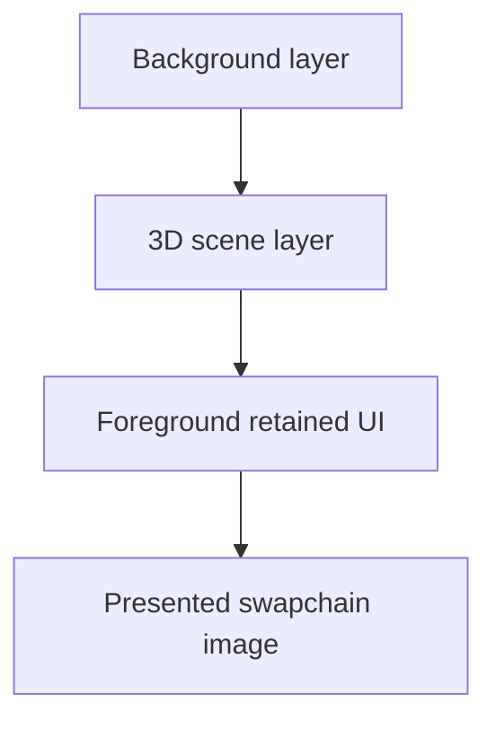

# Rendering Architecture

This project renders a compact scene plus a native-resolution retained UI. The current executable is a learning demo, but the architecture is being shaped as a reusable game-engine foundation in D.

## Visual Stack

The intended frame has three conceptual layers:

1. A far background layer for skybox, star field, or other world backdrop.
2. A 3D scene layer for game objects.
3. A foreground UI layer for retained windows and widgets.

The current code has a simple clear background, selectable placeholder meshes, and a custom UI overlay. The background layer is still mostly conceptual, but the renderer should keep enough separation for it to become a real pass later.

## 3D Scene Layer

The scene currently renders selectable Platonic solids from [source/vulkan/models/polyhedra.d](../source/vulkan/models/polyhedra.d). These meshes are placeholders for future authored models or game objects.

They are useful because they exercise the important engine paths:

- indexed geometry
- normals
- texture coordinates
- filled, wireframe, and hidden-line render modes
- depth buffering
- per-frame transform updates

[source/vulkan/engine/renderer.d](../source/vulkan/engine/renderer.d) transforms the mesh into the current view, uploads vertex/index data, updates uniforms, and records the draw commands.

## UI Layer

The foreground UI is a retained widget system rendered in native window pixels. It is not a screenshot texture or an immediate-mode debug overlay. Widgets generate panel and text geometry, and the renderer uploads that geometry into per-frame overlay buffers.

The ownership split is:

- `source/vulkan/ui/` contains reusable UI engine classes such as `UiWidget`, `UiWindow`, `UiScreen`, layout containers, labels, buttons, and render helpers.
- [source/demo/demo_ui.d](../source/demo/demo_ui.d) contains the current demo-specific screen construction.
- [source/vulkan/engine/renderer.d](../source/vulkan/engine/renderer.d) consumes the generated overlay geometry and draw ranges.

The renderer should eventually know only generic UI render output names, not HUD-specific names. Existing names such as `HudOverlayGeometry` and `HudWindowDrawRange` are migration-era names and should be replaced with generic `Ui...` names during the next cleanup.

## Frame Order

A frame should follow a stable order:

1. Process input and update runtime state.
2. Update camera, scene, and UI state.
3. Build or update scene geometry.
4. Build UI overlay geometry.
5. Upload scene and UI data into current frame resources.
6. Record command buffers.
7. Submit and present.

That order keeps the data flow one-directional. Runtime state produces geometry; geometry becomes GPU-visible buffers; command buffers describe the frame.

## Engine Boundary

The long-term goal is to extract the reusable engine pieces into an Engine-only D module. The demo exists to keep those pieces exercised while the shape settles.

Reusable engine candidates:

- SDL/Vulkan bootstrap abstractions once they are no longer demo-specific
- Vulkan instance/device/swapchain/pipeline/resource helpers
- retained UI engine under `source/vulkan/ui/`
- font atlas and text geometry support
- mesh and asset-facing abstractions after placeholder geometry is replaced

Demo-only candidates:

- current Platonic-solid scene selection
- current demo windows and text
- demo settings keys and sample profiles
- old HUD helper functions kept only as migration remnants

## Decision Points

The next architecture decisions are:

- replace HUD-specific render data names with generic UI names
- remove the old stateless HUD construction path from `demo_ui.d`
- make `DemoUiScreen` use generic `UiScreen` helpers consistently
- decide how far renderer ownership should be split before publishing a first package
- decide which settings belong to the engine and which belong only to the demo application

## Related Files

- [source/vulkan/engine/renderer.d](../source/vulkan/engine/renderer.d)
- [source/vulkan/engine/pipeline.d](../source/vulkan/engine/pipeline.d)
- [source/vulkan/models/polyhedra.d](../source/vulkan/models/polyhedra.d)
- [source/vulkan/ui/ui_screen.d](../source/vulkan/ui/ui_screen.d)
- [source/demo/demo_ui.d](../source/demo/demo_ui.d)
- [docs/vulkan-quickstart.md](vulkan-quickstart.md)
- [docs/ui-architecture.md](ui-architecture.md)
