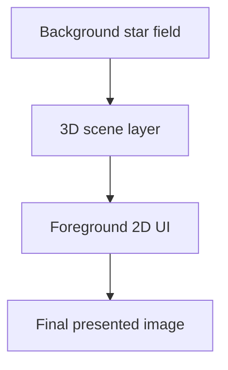

# Rendering Architecture

This project renders the scene as a layered composition instead of a single flat frame. The result is easier to reason about, easier to extend, and closer to the way a senior renderer or engine developer would think about the frame graph.

## Visual Stack

The rendered image is built in three main depth regions:

1. The far background contains a star field.
2. The middle layer contains the 3D world objects.
3. The foreground contains the custom 2D interface with translucent windows and widgets.

A practical mental model is shown below.

## Background Layer

The background is intended to behave like a distant skybox or star field. It should read as far away from the camera and should move in a controlled way when the player rotates the ship or the camera. The important property is not visual complexity, but parallax coherence.

For implementation purposes, the background layer should be treated as a distinct rendering concern:

- it may use its own texture or procedural generation
- it should be rendered before the 3D scene
- its movement should be tied to the same orientation state as the ship or camera
- it should not share UI logic with the foreground

The current codebase keeps this layer conceptually separate even when the exact visual treatment is still simple.

## 3D Middle Layer

The center of the image is reserved for 3D objects. In the current repository, the Platonic solids are used as placeholders for future ship models.

That choice is deliberate:

- the geometry is simple enough to debug visually
- the meshes exercise indexing, normals, and texturing
- the objects are easy to rotate and animate
- they make the frame pipeline visible without needing art assets

This layer is where most Vulkan-specific work lives:

- vertex and index buffers
- depth buffering
- transformation updates per frame
- descriptor bindings for uniforms and textures
- pipeline selection for filled, wireframe, and hidden-line views

The renderer should keep this layer independent from the UI layer so that the 3D system can evolve without forcing changes in the interface code.

## Foreground UI Layer

The foreground contains the custom 2D interface. It is rendered in native window pixels and uses semi-transparent windows so the 3D scene remains visible behind it.

The UI is intentionally not treated as a texture atlas screenshot or as a post-process overlay. Instead, it behaves like a real retained or semi-retained interface layer with explicit geometry generation.

The intended abstraction is a small class tree or type hierarchy for:

- windows
- panels
- widgets or gadgets
- text and decorative primitives

A good separation is:

- one base type for common visual and layout behavior
- one type for container-like windows
- one type for child widgets
- one renderer-facing layer that turns the UI tree into vertices

This keeps the UI data structure independent from Vulkan. The renderer then only sees geometry, descriptors, and textures.

## Frame Order

A frame should follow a stable order:

1. Update simulation state.
2. Rotate background and 3D orientation state.
3. Build the 3D vertex data for the placeholder solids.
4. Build the 2D UI geometry.
5. Upload data into the current frame resources.
6. Record commands.
7. Submit and present.

That order matters because it keeps the data flow one-directional. Simulation generates geometry, geometry becomes draw commands, and the frame is then handed to the GPU.

## Why This Layout Works

This split is useful for several reasons:

- the background can be replaced without touching the UI layer
- the 3D layer can grow from placeholder geometry to real ships
- the UI can stay crisp because it is rendered in native resolution
- each layer can be debugged independently
- resource ownership stays visible instead of being hidden in a monolithic renderer

This is a good shape for a codebase that wants to remain understandable while still being close to production rendering patterns.

## Decision Points

There are a few natural choices that may evolve later:

- whether the background becomes procedural or texture based
- whether the 3D layer keeps placeholder geometry or switches to authored assets
- whether the UI tree stays custom or gets replaced by a specialized immediate-mode or retained-mode system
- whether the overlay uses a fully retained widget tree or a hybrid with generated geometry

The current repository is best understood as a compact rendering spine that leaves those decisions open without making the frame architecture ambiguous.

## Related Files

- [source/vulkan/renderer.d](../source/vulkan/renderer.d)
- [source/vulkan/hud.d](../source/vulkan/hud.d)
- [source/vulkan/polyhedra.d](../source/vulkan/polyhedra.d)
- [docs/vulkan-quickstart.md](vulkan-quickstart.md)
- [docs/shaders.md](shaders.md)
