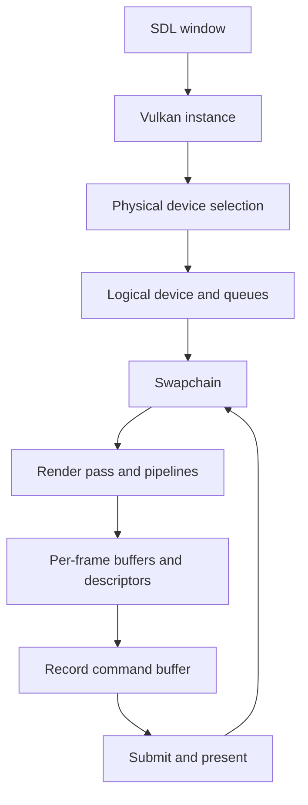

# Vulkan Quickstart

This project is a small Vulkan application with a deliberately explicit frame pipeline. The useful mental model is:

1. SDL creates the window and surface.
2. Vulkan instance and device selection happen next.
3. The swapchain and render pass define the presentation contract.
4. Per-frame buffers, descriptors, and synchronization objects are allocated.
5. Each frame updates data, records commands, submits work, and presents.

## Frame Flow

## Why the Structure Matters

The code keeps ownership explicit:

- window ownership is isolated in [source/window.d](../source/window.d)
- instance and device lifetime are separated from the renderer
- swapchain-dependent resources are recreated when the surface becomes invalid
- per-frame resources are double-buffered to keep updates deterministic

That separation is the part senior developers usually care about first when they need to extend the project, whether the next step is adding more passes or evolving the overlay system.

## Practical Vulkan Concepts

- A render pass describes attachments and subpass dependencies.
- A swapchain owns the images that ultimately reach the screen.
- Descriptor sets bind per-frame uniforms and sampled textures.
- Command buffers encode the draw sequence for one frame.
- Fences and semaphores keep CPU and GPU work synchronized.

## Deep References

- Vulkan Guide: https://vkguide.dev/
- Vulkan Specification: https://registry.khronos.org/vulkan/specs/1.3-extensions/html/
- Vulkan Tutorial: https://vulkan-tutorial.com/
- Khronos Vulkan Samples: https://github.com/KhronosGroup/Vulkan-Samples
