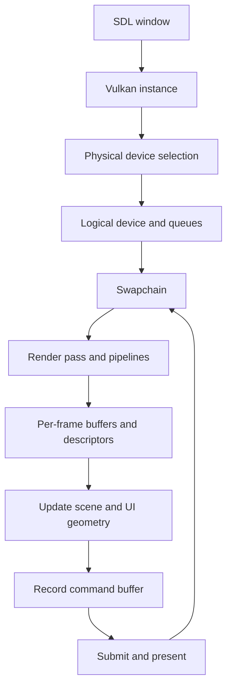

# Vulkan Quickstart

This project is a small SDL2/Vulkan application with a deliberately explicit frame pipeline. The code is currently a demo application, but the rendering structure is intended to become the Vulkan spine of a reusable D game-engine module.

## Frame Flow

## Ownership

The code keeps ownership explicit:

- [source/demo/app.d](../source/demo/app.d) loads bindings, initializes SDL, loads settings, and creates the renderer.
- [source/sdl2/window.d](../source/sdl2/window.d) owns the SDL window wrapper and Vulkan surface creation helper.
- [source/vulkan/engine/instance.d](../source/vulkan/engine/instance.d) owns the Vulkan instance.
- [source/vulkan/engine/device.d](../source/vulkan/engine/device.d) selects the physical device and owns the logical device and queues.
- [source/vulkan/engine/swapchain.d](../source/vulkan/engine/swapchain.d) owns swapchain images and image views.
- [source/vulkan/engine/pipeline.d](../source/vulkan/engine/pipeline.d) owns render pass, descriptor layout, pipeline layout, and graphics pipelines.
- [source/vulkan/engine/renderer.d](../source/vulkan/engine/renderer.d) owns the frame loop, resources, command buffers, and the bridge between the scene and demo UI.

## Per-Frame Work

For each frame, `VulkanRenderer`:

1. Waits for the current in-flight fence.
2. Acquires a swapchain image.
3. Updates scene uniforms and mesh vertex/index buffers.
4. Asks the demo UI screen to produce overlay vertices.
5. Uploads panel and text vertices into per-frame overlay buffers.
6. Records scene, wireframe, and UI draw commands.
7. Submits the command buffer and presents the image.

This explicit order is intentional. Simulation and UI state produce geometry; geometry is uploaded to the current frame resources; command buffers then describe exactly what the GPU should draw.

## Current Render Layers

- The scene layer renders selectable Platonic solids as placeholder meshes.
- The overlay layer renders retained UI windows in native window pixels.
- Panel quads, image quads, and text quads are uploaded to separate overlay buffers and drawn with separate descriptor sets. UI image quads resolve retained asset ids into a small atlas that combines generated fallback cells with `assets/ui/` PPM demo files.

## Practical Vulkan Concepts

- A render pass describes color/depth attachments and subpass dependencies.
- A swapchain owns the images that ultimately reach the screen.
- Descriptor sets bind per-frame uniforms and sampled textures.
- Command buffers encode the draw sequence for one frame.
- Fences and semaphores keep CPU and GPU work synchronized.
- Swapchain-dependent resources are recreated when the surface becomes invalid.

## Deep References

- Vulkan Guide: https://vkguide.dev/
- Vulkan Specification: https://registry.khronos.org/vulkan/specs/1.3-extensions/html/
- Vulkan Tutorial: https://vulkan-tutorial.com/
- Khronos Vulkan Samples: https://github.com/KhronosGroup/Vulkan-Samples
